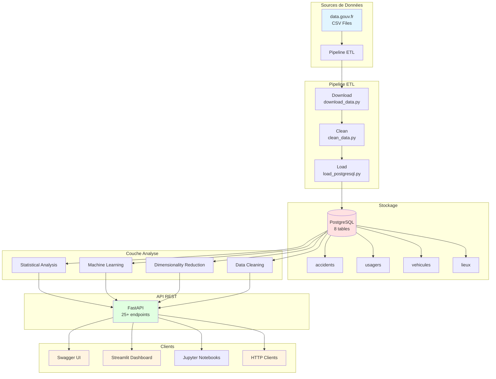
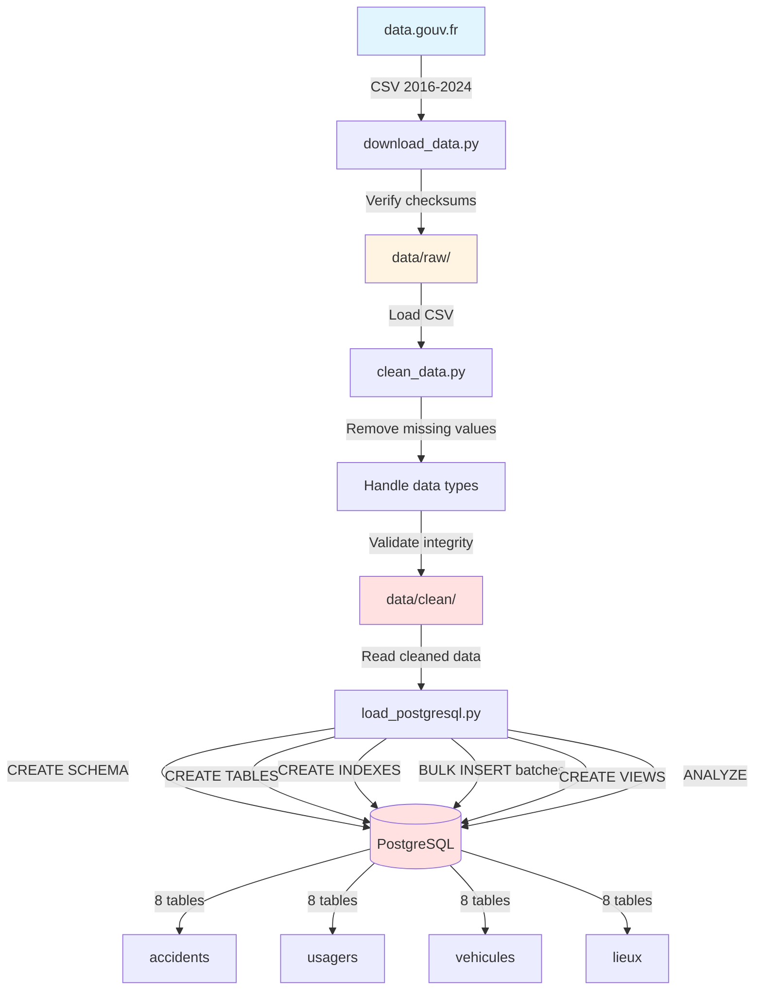
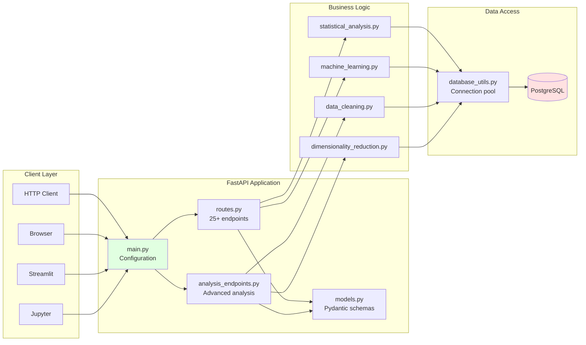
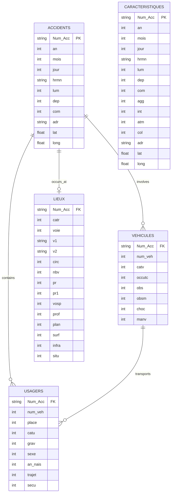
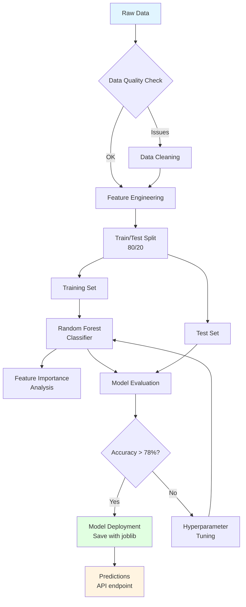
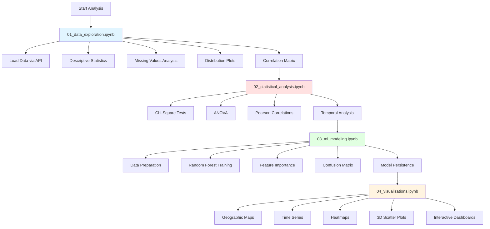
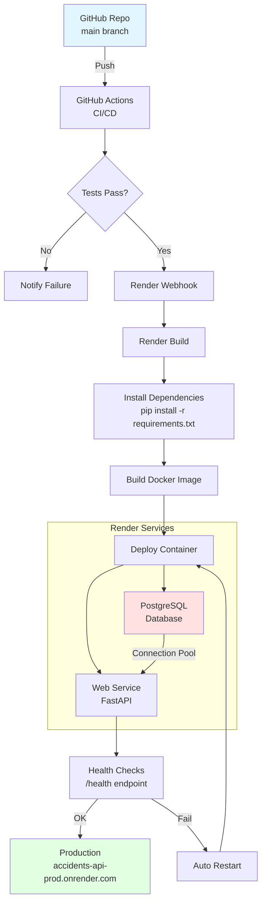
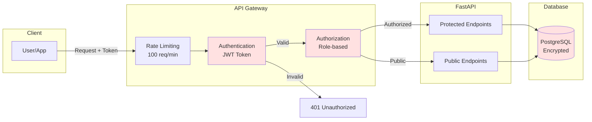
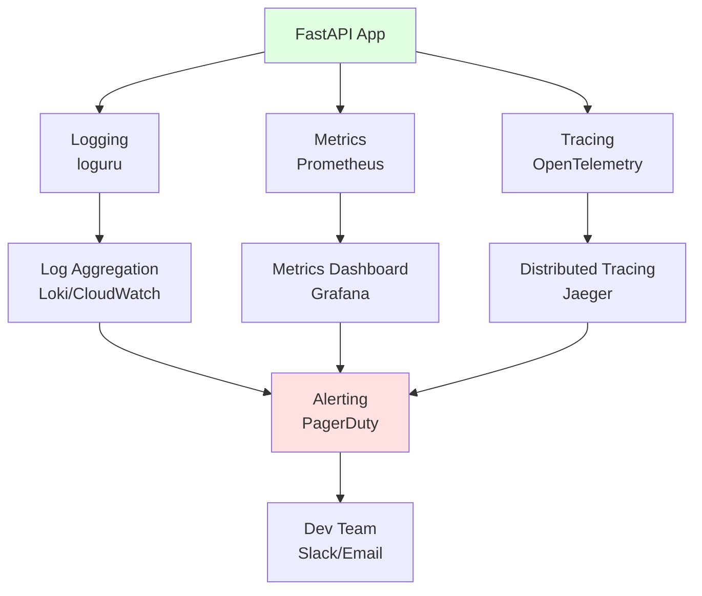

# Architecture du Projet - Diagrammes

## Architecture Globale

## Pipeline ETL - Flux de Données

## Architecture API

## Schéma de Base de Données

## Flux d'Analyse ML

## Workflow des Notebooks

## Déploiement Render.com

## Architecture Sécurité (Future)

## Monitoring & Logging (Future)

